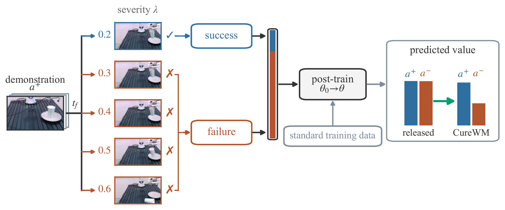
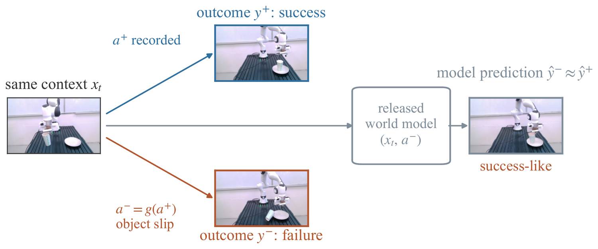
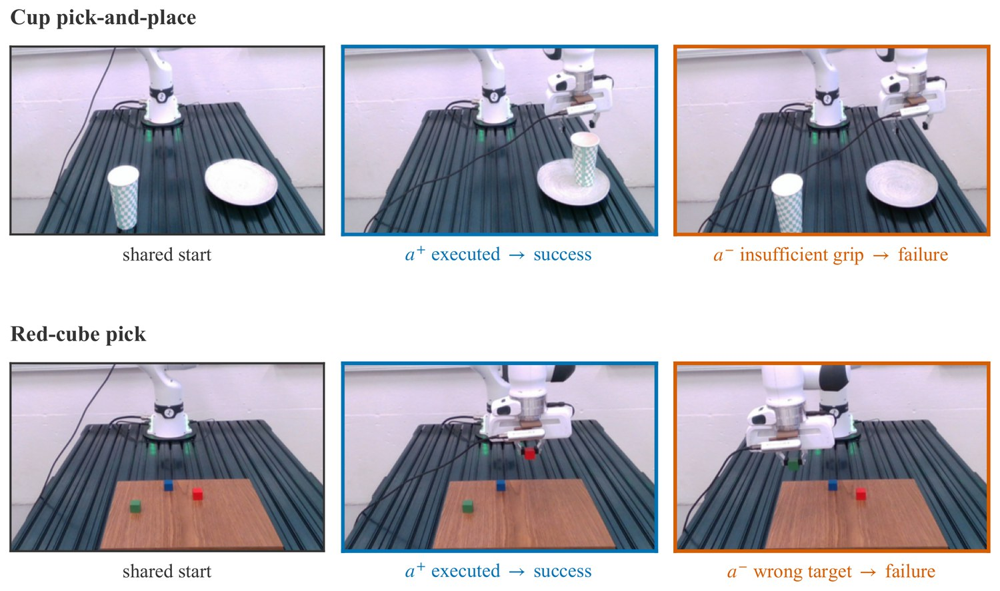
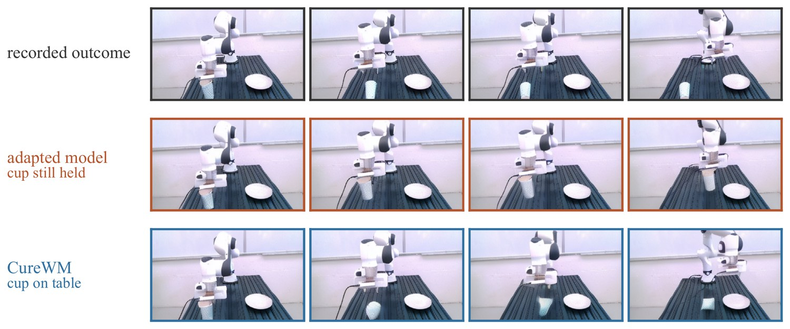

<div align="center">

<h1>World Models Dream of Success</h1>
<h3>Diagnosing and Repairing Failure Insensitivity in Robot World Models</h3>

<p>
  Jiuyi Xu<sup>1</sup>   
  Xiao Hu<sup>2</sup>   
  Meida Chen<sup>3</sup>   
  Peng Gao<sup>4</sup>   
  Yang Ye<sup>2</sup>   
  Yangming Shi<sup>1</sup>
</p>

<p>
  <sup>1</sup>Colorado School of Mines    
  <sup>2</sup>Northeastern University <br>
  <sup>3</sup>Institute for Creative Technologies, University of Southern California    
  <sup>4</sup>North Carolina State University
</p>

<p>
  <a href="LICENSE"></a>
  <a href="https://www.python.org/"></a>
</p>



</div>

---

Released robot world models are used to evaluate policies, score action candidates and
generate training data. All three uses assume the model turns pessimistic when an action
would fail. Across four released checkpoints from two architecture families, it often does
not: failing actions keep high values and success-like futures.

**CureWM repairs a released checkpoint with data alone.** It changes no architecture and no
loss. Take a successful demonstration, perturb its actions across a severity grid,
**execute each variant and let the task decide the outcome**, then fine-tune on the
verified failures and the surviving successes alongside the original data.

The point is the contrast: the same starting context with two different actions and two
different outcomes. A single action per context lets a model fit outcomes without ever
learning what distinguishes a good action from a bad one.

<div align="center">

<p><em>The problem. From one starting context, the recorded action succeeds and a perturbed
action fails when actually executed, yet the released model predicts a success-like future
for both.</em></p>
</div>

## Install

```bash
git clone https://github.com/jiuyixu25/CureWM.git && cd CureWM
pip install -e .          # the engine needs numpy and nothing else
```

Check it works. No simulator, no GPU, about two seconds:

```bash
python3 tests/test_engine.py
```

```
PASS  test_failure_rate_rises_with_severity
PASS  test_families_only_touch_their_own_phases
PASS  test_generate_pairs_labels_outcomes_by_replay
PASS  test_nominal_succeeds
PASS  test_phases_cover_the_trajectory
PASS  test_randomness_is_reproducible
PASS  test_strength_increases_with_severity
```

Simulators and the world-model stack are separate installs. See [`requirements/`](requirements/).

## Run it on your own setup

### 1. Give the engine a simulator

Anything that can reset to a state and execute an action sequence works. That is the whole
interface:

```python
class SimBackend(Protocol):
    def reset_to(self, init_state: dict) -> None: ...
    def rollout(self, actions: np.ndarray) -> dict:
        """-> {"frames", "contacts", "success", "obj_states", "ee_states"}"""
```

LIBERO and ManiSkill3 bindings ship in [`src/curewm/backends/`](src/curewm/backends). Use
them as the template for your own simulator. Each is about 130 lines, and most of that is
converting between the simulator's gripper sign convention and the engine's
(`grip in [0 closed, 1 open]`).

### 2. Build verified counterfactuals

```bash
PYTHONPATH=src python3 scripts/generate_libero.py \
    --suite libero_goal --demos-per-task 10 --out data/pairs
```

Each demonstration produces one nominal replay plus one episode per
*(family, severity, seed)* cell. Every episode is **executed and labelled by the task's own
success predicate**. A perturbation is never assumed to fail, and the ones that survive
are kept as graded successful partners rather than discarded.

```python
from curewm import generate_pairs, sanity_report

index  = generate_pairs(demos, backend, Path("data/pairs"))
report = sanity_report(index)     # failure rate must rise with severity, per family
```

`sanity_report` enforces the screening condition from the paper: a family enters training
only if its empirical failure rate is non-decreasing in severity. A family that fails that
check is miscalibrated for your task. Rescale it in `TASK_SEVERITY_SCALE` rather than
shipping it.

### 3. Convert to your model's training format

```bash
python3 scripts/convert_to_rollout_format.py --src data/pairs --out data/rollout_cure
```

Failures get zero value targets. Surviving replays keep the original labelling rule. For
video-only models, supervision is the frames recorded during execution.

### 4. Post-train

```bash
export CUREWM_ROOT=/path/to/workspace
export CUREWM_ROLLOUT_DIR=data/rollout_cure
export CUREWM_INIT_PT=/path/to/released_weights.pt
bash cluster/train.sh
```

Every arm in the paper is this same launcher with a different mixture. That covers the
step-matched control, the own-failure ablation, and the other-demonstration ablation. All
of them share the initialization, schedule, seed, batch size and sampling ratios. Only the
data differs.

### 5. Measure what changed

```bash
python3 scripts/probe_optimism.py --ckpt <checkpoint> --limit 100
```

Reports **value optimism** (the rate at which a failing action still scores above 0.5) and
**visual optimism** (the rate at which the imagined future looks more like the success
ending than the failure ending).

> Report optimism together with a discrimination measure. Optimism alone can fall simply
> because a model became globally pessimistic, which is not a repair. The paper uses
> $\Delta_{\mathrm{SF}}$, the success-failure value gap, and AUROC alongside it.

## The six perturbation families

Each acts only on the phases it targets, with strength set by a severity in
`SEVERITY_GRID = (0.2, 0.4, 0.6, 0.8, 1.0)`.

| Family | Acts on | At severity `s` |
|---|---|---|
| `insufficient_grip`   | grasp, carry | grip command moved toward open by `0.9s`, capping closure at `1 - 0.9s` |
| `premature_release`   | carry, place | release frame interpolated toward the start of the carry, reaching immediate release at `s=1` |
| `carry_slip`          | carry        | `max(1, round(3s))` brief open pulses of `0.5 + 0.5s`, plus lateral spikes |
| `contact_oscillation` | grasp, carry | oscillation of amplitude `0.7s` about the contact axis |
| `wrist_tilt`          | carry        | sustained tilt of `0.8s` on one wrist axis |
| `approach_overshoot`  | approach     | the approach extended by `0.6s` along its own direction |

Phases come from the gripper command and the recorded contact events. An ambiguous step is
labelled `OTHER` and no family touches it. The random seed deliberately **excludes
severity**, so along one severity axis the pulse positions and axis choices are identical
and the strength effect is not swamped by positional randomness.

Adding a family means subclassing `Perturbation` with a `family` name, `target_phases`, and
an `apply(traj, severity, rng)`.

## On hardware

[`real_robot/`](real_robot/) runs the same protocol on a Franka arm through
[DROID](https://github.com/droid-dataset/droid): scripted demonstration collection,
action-by-action replay, perturbation at a chosen severity, and outcome labelling from
gripper telemetry with an operator veto. Everything is configured by environment variable.
See [`real_robot/README.md`](real_robot/README.md).

<div align="center">

<p><em>Two tasks, each row showing the shared starting scene, a successful execution, and a
failing one. Top: cup pick-and-place, failing under insufficient grip. Bottom: red-cube
picking, failing by taking a distractor. All frames are physical executions rather than
model predictions.</em></p>
</div>

The cube task carries a semantic failure family that the cup task cannot express. Grasping
the wrong object is a clean execution by every mechanical measure, so it separates failures
the model could detect from motion alone from failures it has to read off the scene.

## Results

### LIBERO

Four suites, four metrics, three arms. The baseline sees the same number of fine-tuning
steps as CureWM and differs only in that its mixture carries no counterfactuals. Suite
counts give failed and successful held-out replays. Treatment used Goal demonstrations
only, so Spatial, Object and LIBERO-10 measure transfer.

| Suite | Model | Optimism ↓ | Δ<sub>SF</sub> ↑ | AUROC ↑ | False-pos. ↓ | Task success ↑ |
|---|---|---|---|---|---|---|
| **Goal**<br><sub>484 / 1196</sub> | Released | 79.13 | +0.002 | 0.497 | 30.5 | 98.4 |
| | Baseline | 79.55 | +0.003 | 0.495 | 31.0 | 96.4 |
| | **CureWM** | **30.17** | **+0.282** | **0.743** | 38.0 | 94.8 |
| **Spatial**<br><sub>367 / 443</sub> | Released | 65.67 | -0.014 | 0.518 | 36.6 | 98.4 |
| | Baseline | 64.03 | -0.011 | 0.522 | 36.3 | 95.6 |
| | **CureWM** | **47.68** | **+0.081** | **0.629** | **35.0** | 96.2 |
| **Object**<br><sub>286 / 524</sub> | Released | 54.55 | +0.004 | 0.464 | **57.4** | 99.8 |
| | Baseline | 53.85 | +0.004 | 0.466 | **57.4** | 99.0 |
| | **CureWM** | **37.41** | **+0.086** | **0.587** | 59.4 | 99.8 |
| **LIBERO-10**<br><sub>359 / 331</sub> | Released | 2.51 | -0.001 | 0.479 | 99.7 | 98.0 |
| | Baseline | 2.51 | -0.001 | 0.483 | **99.1** | 96.2 |
| | **CureWM** | 2.51 | **+0.003** | **0.493** | 99.4 | 95.4 |
| **Mean** | Released | 50.47 | -0.002 | 0.490 | 56.1 | 98.65 |
| | Baseline | 49.99 | -0.001 | 0.492 | **56.0** | 96.80 |
| | **CureWM** | **29.44** | **+0.113** | **0.613** | 58.0 | 96.55 |

Two things are worth reading together. Optimism falls furthest on Goal, the suite the
counterfactuals came from, and the gain shrinks with distance from it. On LIBERO-10 the
value head already sits at its floor, which pins the two threshold metrics in every arm and
leaves only the rank-based ones readable. Closed-loop task success is essentially
unchanged against the step-matched control, 96.55 against 96.80 averaged over the suites.

### Hardware, Franka Research 3

Two independent evaluations of the cup pick-and-place task, 15 held-out counterfactual
pairs each. The adapted model is the released checkpoint after the scene adaptation that
every arm receives.

| | Optimism ↓ | Pair ranking ↑ | Δ<sub>SF</sub> ↑ | AUROC ↑ |
|---|---|---|---|---|
| *First evaluation* | | | | |
| Adapted | 13/15 | 80.0% | +0.077 | 0.75 |
| Baseline | 15/15 | 66.7% | +0.066 | 0.65 |
| **CureWM, model 1** | **6/15** | **100.0%** | **+0.251** | **0.95** |
| **CureWM, model 2** | **6/15** | **100.0%** | **+0.271** | **1.00** |
| *Second evaluation* | | | | |
| Adapted | 15/15 | 93.3% | +0.05 | 0.75 |
| Baseline | 12/15 | 66.7% | +0.06 | 0.70 |
| **CureWM, model 1** | **4/15** | **100.0%** | **+0.19** | **0.97** |
| **CureWM, model 2** | **6/15** | 93.3% | **+0.17** | **0.96** |

<div align="center">

<p><em>What the models imagine for an action that fails. The adapted model keeps the cup in
the gripper to the end of the horizon. CureWM predicts the release that was actually
recorded.</em></p>
</div>

Full tables, ablations and the statistical treatment are in the paper.
[`analysis/`](analysis/) carries the probe outputs behind these numbers and the scripts
that compute them, for anyone who wants to check the statistics without rerunning the
training.

## Repository layout

```
src/curewm/          the engine: perturbation families, phase annotation, generate_pairs
  backends/            LIBERO and ManiSkill3 bindings
scripts/             command-line entry points for each pipeline stage
real_robot/          hardware pipeline for a Franka arm
cluster/             post-training launcher and the experiment-config block
analysis/            probe outputs and the statistics behind the paper's tables
tests/               engine contract tests, no simulator required
```

## What is not here

Model weights, fine-tuned checkpoints and the simulator datasets are not redistributed, and
neither is any third-party source. In particular the upstream Cosmos-Policy experiment
config carries an NVIDIA proprietary notice, so
[`cluster/experiment_config_additions.py`](cluster/experiment_config_additions.py) ships
only the block we append to it, with instructions. See [`NOTICE`](NOTICE).

## License

MIT, see [`LICENSE`](LICENSE). Third-party components keep their own licenses. See
[`NOTICE`](NOTICE).
